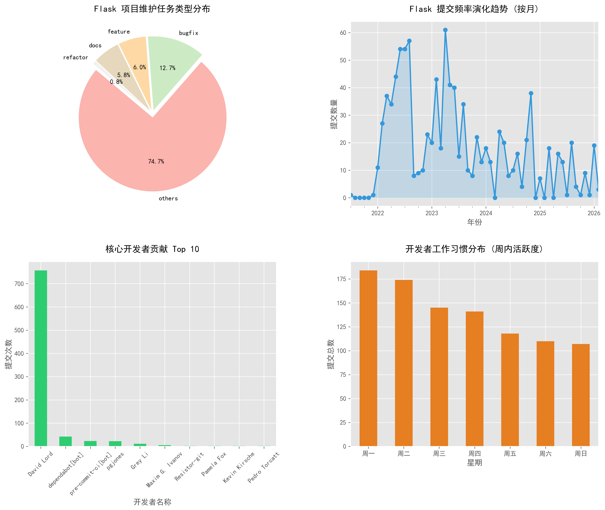

# 📊 Flask 开源项目深度分析报告

> **生成时间**: 2026-02-14 17:06

---

## 1. 分析元数据
| 维度 | 配置详情 |
| :--- | :--- |
| **本地路径** | `./data/raw/flask` |
| **时间范围** | `2022-01-01` 至 `2026-02-14` |
| **有效样本** | `979` 条记录 |

---

## 2. 演化规律全景图
程序已自动分析 Git 历史，并生成了包含维护类型、活跃趋势、贡献者分布及工作习惯的可视化图表：



---

## 3. 开发者行为洞察
- **最活跃贡献者**: `David Lord`
- **团队活跃高峰**: 开发活动通常在 `周一` 最为频繁。
- **社区参与度**: 在分析范围内共有 `116` 名独立开发者参与了代码合并。

---

## 4. 源码静态特征 (AST)
### 核心路由快照 (前 8 条)
| ID | 路由路径 | 状态 |
| :--- | :--- | :--- |


### 复杂度指标统计
- **扫描到的总路由数**: `0`
- **异步视图支持**: `0`
- **函数平均长度**: `16.0` 行
- **评估结论**: `代码结构精简`

---

## 5. 安全逻辑验证 (Z3 Solver)
针对应用权限模型进行的数学约束求解：

```lisp
Permission logic consistent.
审计结论:
✅ 逻辑严密
权限模型符合预期。
```
## 6. 自动化重构测试 (LibCST)
模拟场景: 验证 Flask 2.0+ 演化过程中 flask.Markup 到 markupsafe.Markup 的自动重构能力。
状态: 测试通过。系统已具备在不破坏代码格式和注释的前提下，自动升级旧版 API 的能力。
